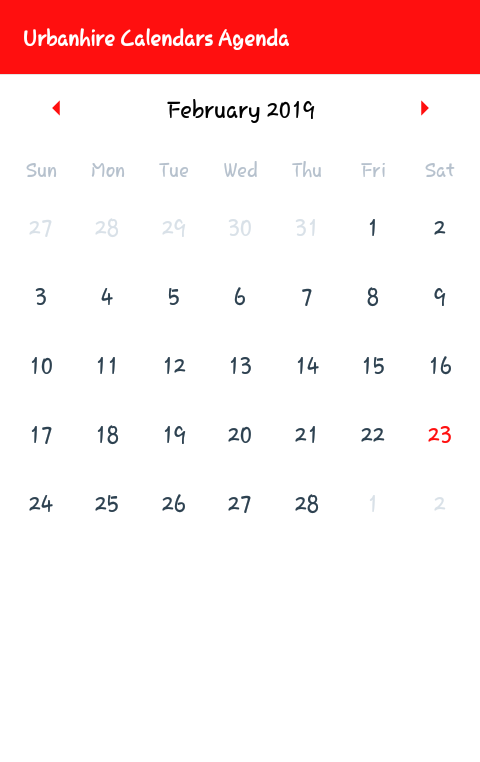
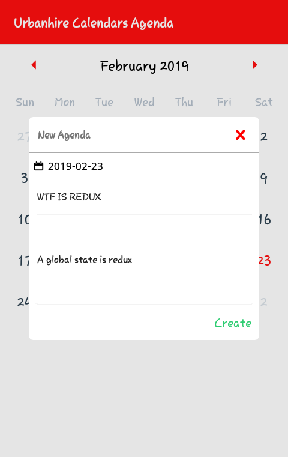
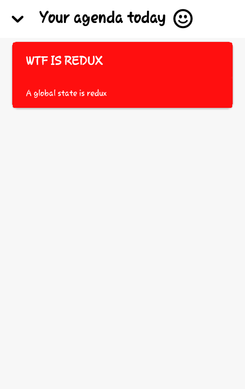

# Reactnative Urbanhire Agenda

*This agenda calendar application is an application that functions to create and display agenda items that you want to do every day. this application uses reactnative technology which is currently being widely used to create an android / IOS based application.*








## Installation

**Step 1:** Clone this repo, `git clone https://github.com/ArifSetiyawan/UrbanhireAgenda.git <your project name>`

**Step 2:** Go to project's root directory, `cd <your project name>`

**Step 3:** Install node modules dependencies

```
npm install or using yarn install
```

*Before run android build, setup [Android Studio](https://facebook.github.io/react-native/docs/android-setup.html)*

**Step 4:** Run apps React Native

```
react-native run-android
```
That's all

If you want to install app in the device, connect your device to the system with debugger mode on and run the above command (app will be installed automatically)
